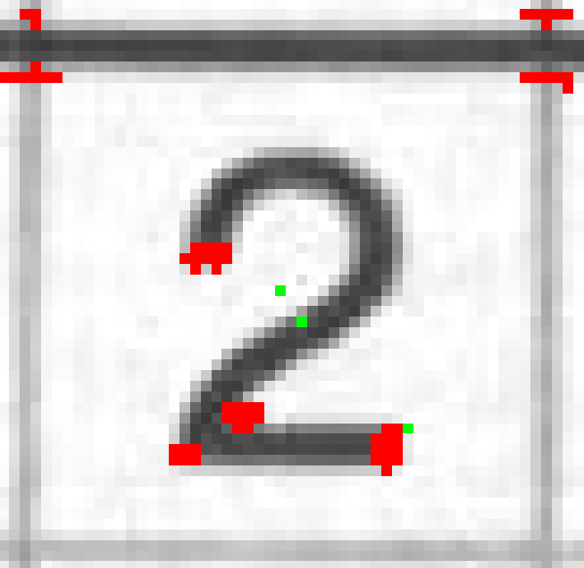

# PRCV 作业1

20337251 伍建霖

## 算法原理

### 1. harris算法

#### 原理

窗口在角点上按任意角度移动时，窗口的灰度图都会有明显的变化。

窗口滑动分别按x和y方向移动[u, v]后，灰度的变化为

$$
E(u,v) = \sum_{x,y}w(x,y) { [I(x+u,y+v)-I(x,y)]^2}
$$
${w(x,y)}$是窗口函数，二维的滤波器。

${I(x+u,y+v)}$和${I(x,y)}$分别是平移前和平移后的窗口灰度图。

再用泰勒公式${f(x+u,y+v) = f(x,y)+uf_x(x,y)+vf_y(x,y)}$ 简化为

$$
E(x,y)=[u,v]M{ \left[
 \begin{matrix}
   u\\v
  \end{matrix}
  \right]}
$$

$$
M=\sum_{x,y}w(x,y){ \left[
 \begin{matrix}
   I_x^2&I_xI_y\\
   I_xI_y&I_y^2
  \end{matrix}
  \right]}
$$

${I_x}$和${I_y}$为x和y方向的梯度值，可以用Sobel进行计算。

接着${M}$可以用实对称矩阵对角化进一步化简：

$$
M=R^{-1}
{\left[
 \begin{matrix}
   \lambda_1&0\\
   0&\lambda_2
  \end{matrix}
  \right] }
  R
$$
最后根据${\lambda_1}$和${\lambda_2}$计算角点响应函数R：

$$
R={\lambda_1\lambda_2}-k(\lambda_1+\lambda_2)^2
$$
k为经验常数，一般取0.04-0.06。

当R很小且小于threshold时，认为是平坦区域；

当R<0且R<threshold时，认为是边缘；

当R>0且R>threshold时，认为是角点。

#### 步骤

1. 计算${I_x}$和${I_y}$
2. 计算${I_xI_y}$
3. 把${w(x,y)}$，一般是高斯滤波器，应用到${I_x}$、${I_y}$和${I_xI_y}$上，计算$M$矩阵
4. 计算响应值R

#### 特性

Harris角点检测算法具有平移不变性和旋转不变性，但它不满足尺度不变性。

### 2. sift描述子

#### 原理

​	描述子的作用是在找到关键点后将关键点描述出来，好的描述子应该具有平移不变性、旋转不变性和尺度不变性。sift描述子是建立在DoG算法上的，DoG算法已经能够检测出平移和尺度变化后的关键点，sift描述子就只需要解决旋转不变性即可。sift描述子通过计算各个方向的方向向量来实现旋转不变性。

#### 步骤

1. 找到关键点
2. 将关键点图像划分为4x4的小块，再将小块划分为4x4的小小块
3. 对于每个小小块，计算其内部的梯度幅值和梯度方向，然后将梯度方向分成8个方向，每个方向覆盖45度，并将该方向上的梯度幅值累加起来，每个小块拥有8个方向的方向向量。
4. 把每个小块的方向向量组成一个8维向量
5. 所有8维向量拼接起来得到一个128维向量，这就是一个sift描述子

### 3. hog描述子

#### 步骤

1. 预处理：灰度化，gamma矫正
2. 将图像划分为窗口(window)，窗口划分为块(block)，块划分为细胞(cell)
3. 归一化减少光照的影响
4. 计算梯度：像素点计算梯度，判断所属方向区间（9个方向）
5. 细胞内构建梯度直方图：像素点梯度加权统计
6. 块内梯度直方图归一化：假设一个块有4个细胞，每个细胞9维向量，共4个9维向量
7. 拼接生成HOG特征向量

#### 数值计算

窗口特征向量维度：窗口64x128，块8x8，细胞4x4，那么一个窗口有7x15个块，一个块有4个细胞，那么一个块就有4个9维向量，一个窗口就有7x15x4x9=3780维度的向量。

梯度只算180度，即将180度划分为9个方向，而不是360度，因为完全相反的梯度被认为是同一个梯度方向。

### 4. ransac算法

#### 步骤

1. 选取一组点（直线2个点）
2. 计算模型
3. 计算局内点
4. 根据局内点重新计算

#### 图像拼接中的作用

假设img1和img2上都找到了n个关键点，并且一一对应。那么在sift描述子上选取一组点，计算出一个变换矩阵（也就是模型）。如果img1中的关键点n1能够变换为img2中的n2关键点，则将该描述子纳入局内点。

## 实验步骤

### harris算法实现角点检测

先读入库和图片

```python
import cv2
import numpy as np

# 1. read img as gray scale image
img = cv2.imread("../images/1/sudoku.png")
o = cv2.cvtColor(img, cv2.COLOR_BGR2GRAY)
```

计算x和y方向的梯度，并计算${I_xI_y}$ 

```python
# 2. get I_x and I_y with sobel
sobelx = np.float32(cv2.Sobel(o, cv2.CV_16S, 1, 0, ksize=3))
sobely = np.float32(cv2.Sobel(o, cv2.CV_16S, 0, 1, ksize=3))
sobelxy = np.zeros(np.shape(sobelx), dtype=np.float32)
sobelxy = sobelx * sobely
```

定义变量，M保存梯度，valueM保存特征值，R为响应值

```python
M = np.zeros([o.shape[0], o.shape[1], 3])
valueM = np.zeros([M.shape[0], 2])
R = np.zeros([o.shape[0], o.shape[1]])
k = 0.04
```

将梯度赋值给M，并进行高斯平滑

```python
M[:, :, 0] = np.reshape(
    [x**2 for row in sobelx for x in row], (M.shape[0], M.shape[1])
)
M[:, :, 1] = np.reshape(
    [x**2 for row in sobely for x in row], (M.shape[0], M.shape[1])
)
M[:, :, 2] = np.reshape([x for row in sobelxy for x in row], (M.shape[0], M.shape[1]))

M[:, :, 0] = cv2.GaussianBlur(M[:, :, 0], ksize=(3, 3), sigmaX=2)
M[:, :, 1] = cv2.GaussianBlur(M[:, :, 1], ksize=(3, 3), sigmaX=2)
M[:, :, 2] = cv2.GaussianBlur(M[:, :, 2], ksize=(3, 3), sigmaX=2)
M = [
    np.array([[M[i, j, 0], M[i, j, 2]], [M[i, j, 2], M[i, j, 1]]])
    for i in range(o.shape[0])
    for j in range(o.shape[1])
]
M = np.reshape(M, (o.shape[0], o.shape[1], 2, 2))
```

计算特征值并计算出响应值

```python
valueM, _ = np.linalg.eig(M[:, :])

# 6. calculate R by R = l1*l2 - k(l1+l2)^2
l1 = valueM[:, :, 0]
l2 = valueM[:, :, 1]
R[:, :] = (l1 * l2) - k * ((l1 + l2) ** 2)
```

响应值高的且不为负数的位置为角点，将对应位置标红

```python
# 7. use threshold to judge
R_max = np.max(R)
offset = 0
radius = 1
for i in range(R.shape[0]):
    for j in range(R.shape[1]):
        if R[i][j] > R_max * 0.1 and R[i][j] > 0:
            img[i + offset][j + offset] = (0, 0, 255)
        # 极大化抑制
        # if (
        #     R[i][j] > 0
        #     and R[i][j] > R.max() * 0.1
        #     and R[i, j]
        #     == np.max(
        #         R[
        #             max(0, i - radius) : min(i + radius, R.shape[0]),
        #             max(0, j - radius) : min(j + radius, R.shape[1]),
        #         ]
        #     )
        # ):
        #     img[i + offset, j + offset] = (0, 0, 255)
```

### sift描述子进行角点匹配并进行全景图拼接

先读入库和图片，并将图片转成灰度图

```python
import cv2
import numpy as np

# 1. read img
img1 = cv2.imread('./images/1/uttower1.jpg')
img2 = cv2.imread('./images/1/uttower2.jpg')

gray1 = cv2.cvtColor(img1, cv2.COLOR_BGR2GRAY)
gray2 = cv2.cvtColor(img2, cv2.COLOR_BGR2GRAY)
```

创建并计算sift描述子，得到关键点和描述子

```python
# 2. create sift descriptor
sift1 = cv2.SIFT_create()
sift2 = cv2.SIFT_create()
kp1, des1 = sift1.detectAndCompute(gray1, None)
kp2, des2 = sift2.detectAndCompute(gray2, None)
# img_o1 = cv2.drawKeypoints(gray1, kp1, img1)
# img_o2 = cv2.drawKeypoints(gray2, kp2, img2)
```

用欧式距离进行关键点匹配，并画出匹配线

```python
# 3. match
bf = cv2.BFMatcher(cv2.NORM_L2, crossCheck=False)
matches = bf.match(des1, des2)
matches = sorted(matches, key=lambda x: x.distance)
img_match = cv2.drawMatches(img1, kp1, img2, kp2, matches[: 50], img2, flags=2)
```

先转换出坐标，然后计算出变换矩阵并拼接

```python
# 4. compute ransac
kps1 = np.float32([kp.pt for kp in kp1])
kps2 = np.float32([kp.pt for kp in kp2])
pt1 = np.float32([kps1[match.queryIdx] for match in matches])
pt2 = np.float32([kps2[match.trainIdx] for match in matches])

H, status = cv2.findHomography(pt2, pt1, cv2.RANSAC, 4)

result = cv2.warpPerspective(
            img2, H, (img2.shape[1] + img1.shape[1], img2.shape[0])
        )
result[0 : img1.shape[0], 0 : img1.shape[1]] = img1
```

### hog描述子进行角点匹配并进行全景图拼接

先读入库和图片，并将图片转换成灰度图

```python
import cv2
import numpy as np

# 读取图像
img1 = cv2.imread('./images/1/uttower1.jpg')
img2 = cv2.imread('./images/1/uttower2.jpg')
gray1 = cv2.cvtColor(img1, cv2.COLOR_BGR2GRAY)
gray2 = cv2.cvtColor(img2, cv2.COLOR_BGR2GRAY)
```

进行harris角点检测，并提取出角点

```python
# Harris 角点检测
harris1 = cv2.cornerHarris(gray1, 2, 3, 0.04)
harris2 = cv2.cornerHarris(gray2, 2, 3, 0.04)

# 提取角点
corners1 = np.argwhere(harris1 > 0.01 * harris1.max())
corners2 = np.argwhere(harris2 > 0.01 * harris2.max())
```

将角点转换成关键点

```python
kp1 = [
    cv2.KeyPoint(float(x), float(y), 8) for x, y in corners1
]
kp2 = [
    cv2.KeyPoint(float(x), float(y), 8) for x, y in corners2
]
keypoints1 = np.float32([m.pt for m in kp1])
keypoints2 = np.float32([m.pt for m in kp2])
```

定义HOG描述子，设置参数并生成HOG描述子

```python
# 提取角点特征
winSize = (2, 2)
blockSize = (2, 2)
blockStride = (1, 1)
cellSize = (1, 1)
nbins = 9
hog = cv2.HOGDescriptor(winSize, blockSize, blockStride, cellSize, nbins)

features1 = []
for i in range(corners1.shape[0]):
    x, y = corners1[i]
    patch = gray1[y-1:y+1, x-1:x+1]
    if patch is None or patch.size == 0:
        continue  # 跳过该 patch
    feature = hog.compute(patch)
    features1.append(feature)
features1 = np.concatenate(features1, axis=0)
features1 = np.float32(features1[:4000])

features2 = []
for i in range(corners2.shape[0]):
    x, y = corners2[i]
    patch = gray2[y-1:y+1, x-1:x+1]
    if patch is None or patch.size == 0:
        continue  # 跳过该 patch
    feature = hog.compute(patch)
    features2.append(feature)
features2 = np.concatenate(features2, axis=0)
features2 = np.float32(features2[:4000])
```

用欧式距离进行关键点匹配，画匹配线

```python
matcher = cv2.BFMatcher(cv2.NORM_L2, crossCheck=False)
matches = matcher.match(features1, features2)
matches = sorted(matches, key=lambda x: x.distance)
img_match = cv2.drawMatches(img1, kp1, img2, kp2, matches[: 100], img2, flags=2)
```

计算出变换矩阵并拼接

```python
result = cv2.warpPerspective(
            img2, H, (img2.shape[1] + img1.shape[1], img2.shape[0])
        )
result[0 : img1.shape[0], 0 : img1.shape[1]] = img1
```

## 实验结果

所有结果都在result/1/中

### harris角点检测

使用sobel进行梯度计算


使用sobel进行边缘检测


harris角点检测


​																				（一开始的结果）

<center>
    
    
    

​    （左边是opencv库的harris检测结果，中间是第一次的检测结果，右边是应用高斯滤波器后的最终结果）

### sift描述子

关键点匹配结果


sift描述子+ransac全景图拼接


### hog描述子

hog描述子特征图

<center>
    
    

## 实验分析

### harris角点检测

​	一开始的窗口大小为1x1，效果并不好，因为在1x1中斜边看着是锯齿状的，也就相当于斜边上的每个像素点是一个角点。后来我变换IxIy，尝试了4种方法计算，效果都不明显；我还尝试将多个像素点一起计算梯度，但效果也不明显。我去观察具体的响应值，发现斜边上的响应值比角点的都大。最后是参考cdsn上的代码，应用了高斯滤波器，这才很好的解决了斜边响应值高的问题。

### sift和hog比较

1. 特征表示方式

​	SIFT 特征是一种局部不变特征，通过检测关键点，提取关键点周围的局部特征描述子，该描述子具有旋转不变性和尺度不变性，适用于在不同尺度和旋转下进行特征匹配。SIFT 特征是基于图像中的局部梯度统计的，它在不同方向上计算梯度直方图，并将梯度直方图组成向量，从而表示特征。

​	HOG 特征是一种全局特征，主要用于目标检测和行人检测等任务中。它通过计算图像中的梯度直方图来描述图像特征，提取图像中目标的纹理信息和形状信息。HOG 特征可以检测不同大小和方向的边缘，形成稠密的梯度直方图，因此对于形状变化不大的目标具有较好的鲁棒性。

2. 特征匹配方式

​	SIFT 特征通常使用基于距离的特征匹配方法，如欧式距离、汉明距离等。在匹配时，通过计算两个特征向量之间的距离来确定它们的相似度。距离越小，相似度越高。

​	HOG 特征通常使用基于 SVM（Support Vector Machine）的分类器来进行匹配。SVM 是一种机器学习算法，它可以对特征进行分类，判断两个特征向量是否属于同一类别。在 HOG 特征匹配过程中，首先需要训练一个 SVM 分类器，将图像分成不同的类别。然后，在测试时，将测试图像中的 HOG 特征向量输入到分类器中进行分类，得到匹配结果。

​	综上所述，SIFT 特征和 HOG 特征在特征表示方式和特征匹配方式上有很大的不同。SIFT 特征适用于需要检测不同尺度和旋转下的局部特征的任务，而 HOG 特征适用于目标检测和行人检测等需要全局特征的任务。

## 参考资料

[(3条消息) opencv学习笔记15: 梯度运算之sobel算子及其函数使用_用sobel算子计算梯度例题_总裁余(余登武)的博客-CSDN博客](https://blog.csdn.net/kobeyu652453/article/details/107149277)

https://zhuanlan.zhihu.com/p/83064609

[第十一节、Harris角点检测原理(附源码) - 大奥特曼打小怪兽 - 博客园 (cnblogs.com)](https://www.cnblogs.com/zyly/p/9508131.html#_label4_1)

