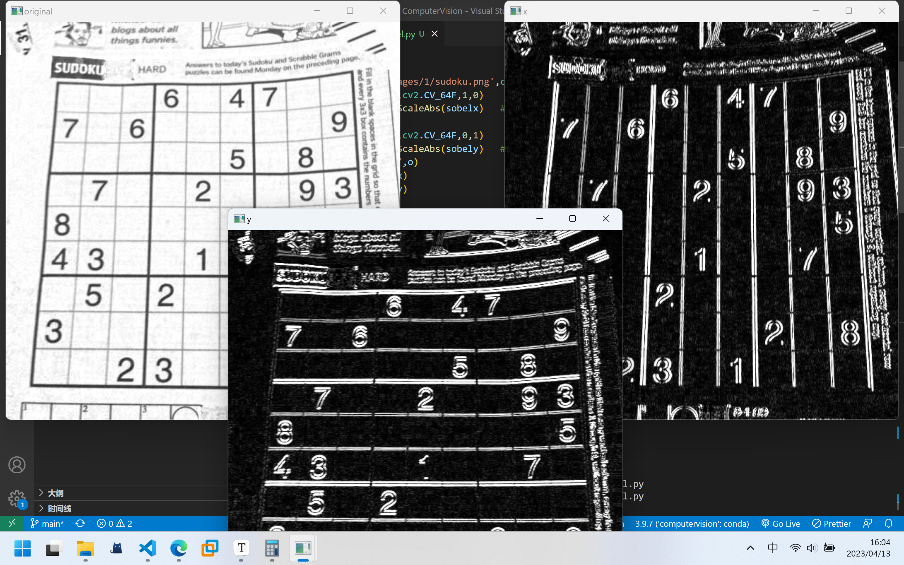
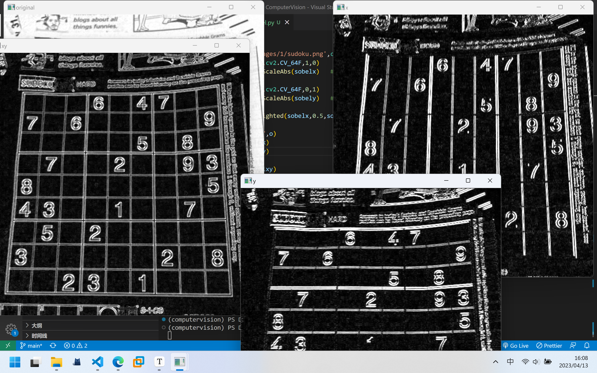

# PRCV 作业1

20337251 伍建霖

## 算法原理
harris算法

sift描述子

hog描述子

ransec算法

## 实验步骤

## 实验结果

使用sobel进行梯度计算

使用sobel进行边缘检测

## 参考资料

[(3条消息) opencv学习笔记15: 梯度运算之sobel算子及其函数使用_用sobel算子计算梯度例题_总裁余(余登武)的博客-CSDN博客](https://blog.csdn.net/kobeyu652453/article/details/107149277)

