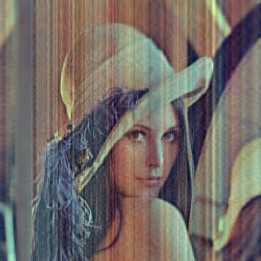
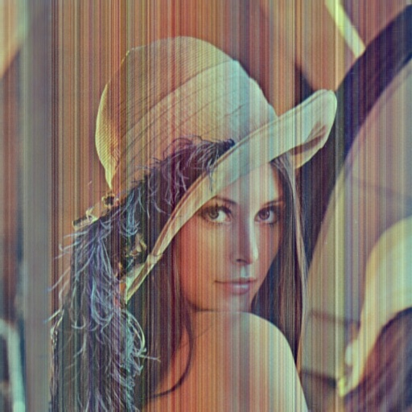

# PRCV 作业2

20337251 伍建霖

## 算法原理

### PCA降维算法

#### 原理


#### 步骤

压缩：

1. 数据归一化
2. 计算协方差矩阵
3. 通过SVG分解，获得协方差矩阵的特征值和特征向量
4. 按特征值大小取前n个特征向量
5. n个特征向量点乘归一化后的数据，得到压缩后的数据

重建：

1. 压缩后的数据点乘n个特征向量的转置即可获得重建后的图像

## 实验步骤

### 一、实现PCA算法

数据归一化：

```python
# 数据归一化
normalized_img = (data - np.mean(data)) / np.std(data)
```

计算协方差矩阵：

```python
# 计算协方差矩阵
covariance_matrix = np.cov(normalized_img, rowvar=False)
```

SVG分解获得特征值和特征向量：

```python
# 特征值分解
eigenvalues, eigenvectors = np.linalg.eig(covariance_matrix)
```

选取前n个特征向量：

```python
# 选择最大的n_components个特征向量
top_eigenvectors = eigenvectors[:, :n_components]
```

压缩数据：

```python
# 将数据映射到低维空间
transformed_data = np.dot(normalized_img, top_eigenvectors)
```


### 二、对灰度图进行PCA降维并重建

读入灰度图：这里有点不同，原始数据为mat文件，其中包含了5000张32x32的人脸，shape为(5000，1024)

```python
# 这里分别把图像降维到10, 50, 100和150维度后重建并可视化前100张人脸
# 读取MAT文件并获取数据，data中有5000张32x32的人脸
data = loadmat("./data/faces.mat")["X"]
```

用上面实现的PCA函数进行降维：

```python
def pca_image(data, n_components):
    # 数据归一化
    normalized_img = (data - np.mean(data)) / np.std(data)

    # 计算协方差矩阵
    covariance_matrix = np.cov(normalized_img, rowvar=False)

    # 特征值分解
    eigenvalues, eigenvectors = np.linalg.eig(covariance_matrix)

    # 选择最大的n_components个特征向量
    top_eigenvectors = eigenvectors[:, :n_components]

    # 将数据映射到低维空间
    transformed_data = np.dot(normalized_img, top_eigenvectors)
```

可视化前49个主成分：主成分即特征向量，这里n_components为49，保留的特征向量的shape为(1024, 49)，所以先转置再reshape，接着归一化并设为8位无符号整型来保证图像能正常显示

```python
    # 将前49个主成分重新转换为图像矩阵
    reconstructed_img = np.reshape(top_eigenvectors.T, (n_components, 32, 32))
    reconstructed_img = (reconstructed_img - np.min(reconstructed_img)) / (np.max(reconstructed_img) - np.min(reconstructed_img)) * 255
    reconstructed_img = reconstructed_img.astype(np.uint8)
    print(reconstructed_img.shape)

    # 前49张人脸可视化
    result = np.zeros([224, 224])

    for i in range(7):
    for j in range(7):
    img = reconstructed_img[i * 7 + j]
    result[i * 32 : i * 32 + 32, j * 32 : j * 32 + 32] = img.T
    result.astype(np.uint8)
    # 绘制原始图像和重构图像
    cv2.imwrite("./result/recovered_faces_top_{}.jpg".format(n_components), result)
    cv2.imshow('Reconstructed Image{}'.format(n_components), result)
    cv2.waitKey(0)
    cv2.destroyAllWindows()
```

重建并可视化压缩后的前100张人脸：

```python
	# 将低维数据重新映射回原始高维空间
    reconstructed_data = np.dot(transformed_data, top_eigenvectors.T)

    # 将重构的数据重新转换为图像矩阵
    reconstructed_img = np.reshape(reconstructed_data, data.shape)
    reconstructed_img = (reconstructed_img - np.min(reconstructed_img)) / (np.max(reconstructed_img) - np.min(reconstructed_img)) * 255
    reconstructed_img = reconstructed_img.astype(np.uint8)

    # 重建前100张人脸并可视化
    result = np.zeros([320, 320])

    for i in range(10):
        for j in range(10):
            img = np.reshape(reconstructed_img[i * 10 + j, :], (32, 32))
            result[i * 32 : i * 32 + 32, j * 32 : j * 32 + 32] = img.T

    result = result.astype(np.uint8)

    # 绘制原始图像和重构图像
    cv2.imwrite("./result/recovered_faces_top_{}.jpg".format(n_components), result)
    cv2.imshow('Reconstructed Image{}'.format(n_components), result)
    cv2.waitKey(0)
    cv2.destroyAllWindows()
```

### 三、对RGB图像进行PCA降维并重建

读入RGB图像：

```python
# 这里尝试将rgb通道分开，然后水平拼接
img = cv2.imread("./data/lena.jpg")
print(img.shape)
```

进行PCA降维：这里和上面的灰度图有些不同，灰度图的shape为(5000, 1024)，每行表示一个样本，每列表示特征，可以计算出(1024, 1024)的协方差矩阵，而RGB图像的每个像素点有R，G，B三个值，我们需要将RGB的三个矩阵水平拼接，比如说RGB图像为512x512，读入的shape为(512, 512, 3)，我们需要拼接为(512, 512*3)，即[R+G+B]

```python
def pca_image(data_raw, n_components):
    # 三通道水平拼接
    data = np.hstack((data_raw[:, :, 0], data_raw[:, :, 1], data_raw[:, :, 2]))

    # 数据归一化
    normalized_img = (data - np.mean(data)) / np.std(data)

    # 计算协方差矩阵
    covariance_matrix = np.cov(normalized_img, rowvar=False)

    # 特征值分解
    eigenvalues, eigenvectors = np.linalg.eig(covariance_matrix)

    # 选择最大的n_components个特征向量
    top_eigenvectors = eigenvectors[:, :n_components]

    # 将数据映射到低维空间
    transformed_data = np.dot(normalized_img, top_eigenvectors)
```

重建并可视化压缩后的图像：这里同样也和灰度图有不同，这里我们需要将数据按三个通道分割，再重建出一个RGB图像

```python
	# 将低维数据重新映射回原始高维空间
    reconstructed_data = np.dot(transformed_data, top_eigenvectors.T)

    # 将重构的数据重新转换为图像矩阵
    reconstructed_img = np.reshape(reconstructed_data, data.shape)
    reconstructed_img = (reconstructed_img - np.min(reconstructed_img)) / (np.max(reconstructed_img) - np.min(reconstructed_img)) * 255
    reconstructed_img = reconstructed_img.astype(np.uint8)

    # 现在将reconstructed_img分割成三个通道，再合并成一张rgb图像
    reconstructed_img_channels = np.hsplit(reconstructed_img, 3)
    final_img = np.zeros_like(data_raw)
    for i in range(3):
        final_img[:,:,i] = reconstructed_img_channels[i]

    # 绘制原始图像和重构图像
    cv2.imwrite("./result/recovered_lena3_top_{}.jpg".format(n_components), final_img)
    cv2.imshow('Reconstructed Image{}'.format(n_components), final_img)
    cv2.waitKey(0)
    cv2.destroyAllWindows()
```

## 实验结果


​	（前49个主成分）

<center>


</center>
（重建后的前100张人脸，从左到右，依次压缩到10，50，100和150维）


<center>




</center>
（重建后的lena.jpg，从左到右，依次压缩到10，50，100和150维）

## 实验分析


## 参考资料

https://blog.csdn.net/biocity/article/details/120589193
